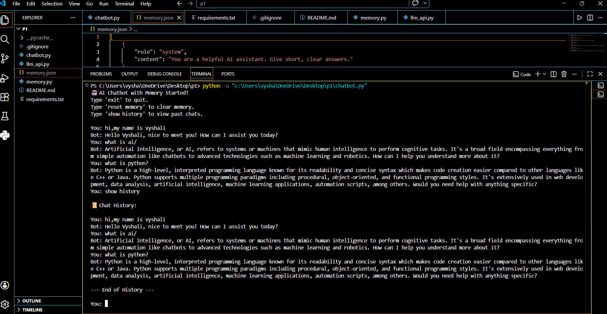

# 🧠 AI Conversational Chatbot with Persistent Memory

## 📌 Project Overview
## 📸 Demo Screenshot



This project is an AI-powered chatbot built using Python and a local AI model through Ollama.

Unlike basic chatbots, this system remembers past conversations by saving chat history into a file. Even after restarting the program, the chatbot can recall previous messages.

---

## 🚀 Features

- 🤖 Local AI chatbot using Ollama
- 🧠 Persistent conversation memory
- 📜 Show chat history command
- 🧹 Reset memory command
- ⚡ Memory size control
- 🧩 Modular Python structure

---

## 🛠 Technologies Used

- Python
- Ollama
- phi3:mini model
- JSON (memory storage)

---

## 📂 Project Structure

```
ai_chatbot_memory/
│
├── chatbot.py
├── llm_api.py
├── memory.py
├── memory.json
├── requirements.txt
├── README.md
├── .gitignore
```

---

## ▶️ How to Run the Project

### Step 1 — Install Dependencies

```
pip install -r requirements.txt
```

---

### Step 2 — Install Ollama

Download from:

https://ollama.com

---

### Step 3 — Download Model

```
ollama run phi3:mini
```

---

### Step 4 — Run Chatbot

```
python chatbot.py
```
---
## 💬 Available Commands

- `exit` → Close chatbot  
- `reset memory` → Clear saved memory  
- `show history` → Display previous messages  

---

## 🎯 Future Improvements

- Add web interface  
- Add API-based models  
- Improve memory intelligence  
- Add user profiles  

---

## 👩‍💻 Author

Vyshali